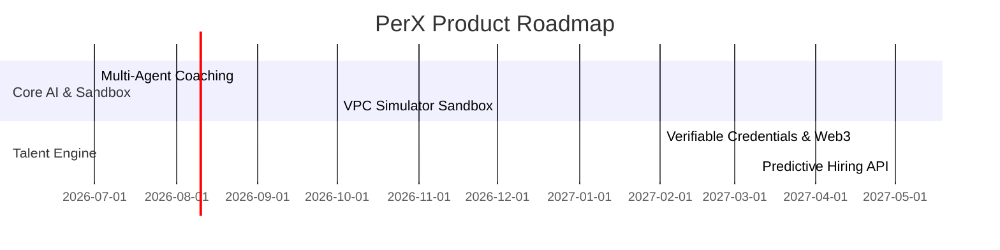

# PerX — Future Vision & Roadmap

This document outlines the strategic vision, product roadmap, and technical scalability blueprint for **PerX**. It serves as a pitch-ready masterplan demonstrating how PerX can scale from a gamified hackathon prototype into a global, enterprise-grade cloud talent accelerator.

---

## 🎯 The Grand Vision
To democratize access to the cloud economy by transforming traditional, high-friction tech training into an addictive, peer-driven, AI-coached RPG (Role-Playing Game). PerX aims to be the **Duolingo + LinkedIn for Cloud Tech Careers**, helping millions of underrepresented graduates navigate the bridge from certifications to six-figure engineering offers.

---

## 🗺️ Product Evolution & Roadmap

### Phase 1: 🤖 Real-time Multi-Agent Guild (Next-Gen AI Coach)
* **Goal**: Evolve the current DeepSeek/Llama chat sidebar into a collaborative guild of specialized AI agents.
* **Architecture**:
  * **The Tutor Agent**: Breaks down complex cloud architectures (AWS, Azure) into micro-learning concepts.
  * **The Code Reviewer Agent**: Integrates with a user's GitHub repo to analyze Terraform configs, CloudFormation files, and Python code, providing real-time feedback.
  * **The Recruiter Agent**: Performs automated, voice-activated technical and behavioral mock interviews tailored to the target role.

### Phase 2: ☁️ VPC Sandbox Simulators (Interactive CLI Challenges)
* **Goal**: Embed interactive, risk-free cloud consoles directly into the roadmap milestones.
* **Concept**:
  * Integrate lightweight web-based terminal sandboxes.
  * Users solve challenges (e.g., "Fix this broken S3 bucket policy" or "Expose this EC2 instance securely") directly inside PerX.
  * Automated background scripts verify completion and instantly award XP and achievements.

### Phase 3: 🏅 Trust-Free Verifiable Credentials (Web3 Badging)
* **Goal**: Transform PerX achievements and badges into cryptographically secure, verifiable career credentials.
* **Mechanism**:
  * Issue course completions, badges, and project milestones as soulbound tokens or verifiable credentials.
  * Employers can instantly verify a candidate's real skill metrics without needing traditional resume reviews or high-friction technical assessments.

### Phase 4: 💼 Predictive Talent Placement & Corporate API
* **Goal**: Connect high-growth organizations directly to pre-vetted, high-potential graduates.
* **Mechanism**:
  * Build a predictive hiring dashboard for HR teams.
  * Instead of searching keyword resumes, recruiters filter candidates by **Verified Readiness Score**, **Active Quest Leaderboard rankings**, and **Mentor ratings**.
  * Matches are made programmatically, bypassing traditional hiring bias and reducing time-to-hire by up to 60%.

---

## 🛠️ Technical Scaling Blueprint

To transition PerX from a high-fidelity frontend simulation to an enterprise-ready software ecosystem, we propose the following backend migrations:

1. **Database Migration (From Mock to SQL/NoSQL)**:
   * Implement **PostgreSQL** or **Cloud Spanner** via **Firebase Data Connect** to securely manage relational user accounts, role definitions, and completed roadmaps.
   * Store fast, real-time message streams for the Community Hub using **Cloud Firestore**.
2. **Vector Search Upgrade (Semantic Knowledge Base)**:
   * Introduce a vector database (e.g., **pgvector** or **Pinecone**) to store and search hundreds of official cloud documentations, whitepapers, and study guides.
   * Elevate the DeepSeek chat tool into a fully-fledged RAG (Retrieval-Augmented Generation) pipeline for hyper-accurate, compliant cloud suggestions.
3. **Serverless Infrastructure & CD**:
   * Migrate TanStack Start's server build targets to run on high-performance edge computing nodes (e.g., **Cloudflare Workers** or **Vercel Edge Functions**) for sub-50ms international load times.
