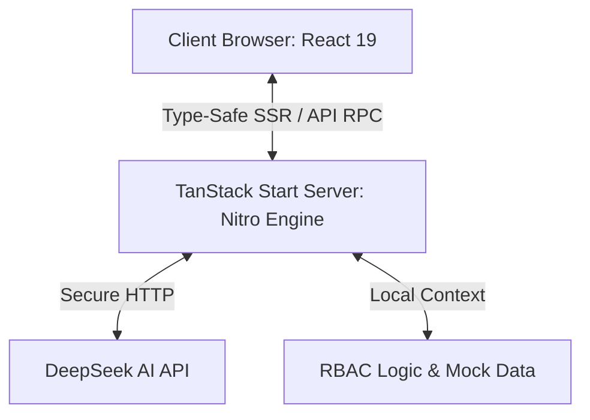

# PerX Technical Overview

Welcome to the technical design and architectural overview of **PerX** — a next-generation, gamified career gateway built to guide cloud technology graduates (such as AWS re/Start) into high-paying, full-time cloud careers.

---

## 🏗️ Core Architecture & Tech Stack

PerX uses a cutting-edge full-stack React architecture that represents the modern standard for fast, type-safe web applications.



### 1. Framework & Runtime
* **React 19 (Stable)**: Uses the latest React engine, utilizing concurrent features and performance-oriented hook lifecycles.
* **TanStack Start**: An advanced full-stack React meta-framework:
  * **TanStack Router**: High-performance, fully type-safe file-system routing.
  * **Nitro Server Engine**: The unified server runtime executing Server-Side Rendering (SSR) and serverless backend API execution.
  * **Vite**: The module bundler powering hot modular replacement (HMR).
* **TypeScript**: Fully typed codebase from frontend widgets down to backend RPC schemas.

### 2. Design System & Aesthetics
* **Tailwind CSS v4**: Built on the native CSS-first Tailwind configuration engine for rapid, zero-overhead compiling.
* **shadcn/ui (Radix UI)**: Low-level unstyled component primitives styled with customized high-end glassmorphism and subtle micro-interactions.
* **Framer Motion v11**: Handles page transition fades, list expansion triggers, and dashboard item scaling.

---

## 🧠 Advanced Feature Modules

### 1. 💬 AI Career Navigator (DeepSeek Chat)
Located in the bottom-right floating widget, the Career Navigator offers real-time, context-aware mentoring.

* **Backend Engine (`src/lib/deepseek.functions.ts`)**: Built using TanStack Start's secure `createServerFn` RPC action.
* **Environment Security**: The DeepSeek API Key stays strictly on the server (`process.env.DEEPSEEK_API_KEY`); it is never exposed to the client's browser.
* **Graceful Fallback System**: To guarantee uninterrupted stability during live presentations or if deployed without an API key:
  * **Interactive Matching**: It intercepts standard questions (like *"Compare AWS Bedrock vs Azure OpenAI"* or *"Explain RAG simply"*) and instantly serves high-quality pre-computed responses.
  * **Polished Demo Cards**: If a general question is asked without a key, it returns a friendly conversational card instructing the admin on how to bind the secret on Vercel, rather than throwing errors.

### 2. 🌿 Dynamic 20-Step Career Roadmaps
A branching, visual progression timeline guiding learners from foundational training through intermediate skills (IaC, CI/CD, Containers) and final networking stages.
* **Integration**: Powered by the DeepSeek completion model.
* **Fallback**: Instantly falls back to loading the authoritative 20-step pre-computed roadmap from `src/data/mockData.ts` if the live endpoint is unavailable.

### 3. 🛡️ Role-Based Access Control (RBAC)
A granular roles-and-permissions rules engine (`src/data/rbac.ts`) that manages:
* **Roles**: `learner` (Alex Rivera), `mentor` (Priya Sharma), and `admin` (Jordan Blake).
* **Sidebar Filters**: Dynamically modifies sidebar links depending on the permissions of the logged-in role.
* **Admin Matrix Panel (`/admin`)**: A visual permission matrix mapping 12 platform actions against role hierarchies.

---

## 📁 Key File Structure

```bash
├── .env.example              # Public secrets template for teammates
├── .gitignore                # Strictly excludes all local .env files
├── package.json              # Direct Node dependencies
├── vite.config.ts            # Vite bundler options
├── src/
│   ├── context/
│   │   ├── AuthContext.tsx   # Login, session state, and active role
│   │   └── UserContext.tsx   # Gamified stats (Level, XP, progress)
│   ├── data/
│   │   ├── demoData.ts       # Enhanced static conversations
│   │   ├── mockData.ts       # Authoritative milestones, quests, and badges
│   │   └── rbac.ts           # Access control rules and sidebar routes
│   ├── lib/
│   │   └── deepseek.functions.ts # Server-side DeepSeek API & fallbacks
│   └── routes/
│       ├── __root.tsx        # Base shell layout, SVG favicon, and router context
│       ├── index.tsx         # Gamified Explorer Dashboard
│       ├── roadmap.tsx       # AI Roadmap view
│       ├── admin.tsx         # Admin Console
│       └── community.tsx     # Message threads
```

---

## 🚀 Setup & Execution Guide

### Local Development Setup
1. **Clone & Install**:
   ```bash
   npm install
   ```
2. **Setup Secrets**:
   Create a `.env` file at the root level and add your DeepSeek API credentials:
   ```env
   DEEPSEEK_API_KEY=your_private_deepseek_key
   ```
3. **Launch dev environment**:
   ```bash
   npm run dev
   ```
   Open **`http://localhost:8080`** in your browser.

### Cloud Deployment (Vercel)
1. **Connect Repository**: Import the repository in Vercel.
2. **Configure Environment Secrets**:
   * Navigate to **Settings** -> **Environment Variables**.
   * Add a variable named `DEEPSEEK_API_KEY` with your private credentials.
3. **Build & Deploy**: Click Deploy!
